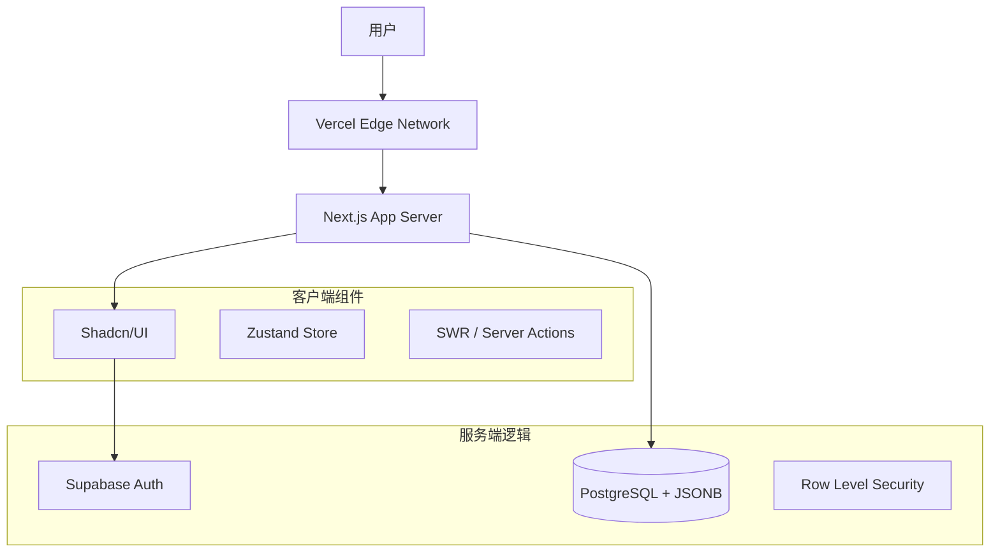

<div align="center">
  
  <h1>WEAPI: The Geek's Holy Land</h1>
  
  <p align="center">
    <strong>一款现代化的 Web API 聚合与管理平台 | A Modern API Marketplace & Aggregation Platform</strong>
  </p>

  <p>
    <a href="https://github.com/hnsxyren1023-commits/weapi/blob/main/LICENSE">
      
    </a>
    
    
    
    
  </p>
</div>

---

## 📸 应用界面 (Interface)

> *[Place Screenshots Here - 自动生成预览图]*

## ✨ 功能特性 (Features)

- 🔍 **智能搜索**: 基于分词的全文检索，快速定位 API。
- 📦 **API 详情**: 集成 Swagger UI，原生渲染 OpenAPI Spec (JSONB)。
- 🔐 **安全认证**: 基于 Supabase Auth 的 RLS 数据级权限控制。
- ☁️ **云端同步**: 完整的 Next.js + Supabase 架构，支持 Vercel 一键部署。
- 🎨 **极致体验**: 采用 Tailwind CSS + Shadcn/ui 打造的现代化响应式界面。
- 🛠️ **Mock 模式**: 独创的离线容错机制，数据库断连时不影响核心浏览。

## 🛠️ 技术架构 (Architecture)

WEAPI 采用最前沿的 **Next.js 16 (App Router)** 全栈架构，结合 **Supabase** 进行后端即服务 (BaaS) 的开发。



### 目录结构

```bash
weapi/
├── src/
│   ├── app/              # Next.js App Router 页面
│   ├── components/       # Shadcn/ui 及业务组件
│   ├── lib/
│   │   └── supabase/     # Supabase 客户端 (Client/Server/Middleware)
│   ├── scripts/          # 数据灌入与维护脚本
│   └── store/            # 状态管理 (Zustand)
├── doc/                  # 项目文档与技术白皮书
└── public/               # 静态资源
```

## 🚀 快速开始 (Quick Start)

### 1. 环境准备
确保已安装 Node.js 20+ 和 npm/pnpm。

### 2. 克隆项目
```bash
git clone https://github.com/hnsxyren1023-commits/weapi.git
cd weapi
```

### 3. 配置环境变量
复制 `.env.local.example` 为 `.env.local` 并填入 Supabase 密钥：
```bash
cp .env.local.example .env.local
```

### 4. 启动服务
```bash
npm install
npm run dev
```

## 🤝 贡献指南 (Contributing)
欢迎提交 Pull Request 或 Issue！我们也推荐查阅 `doc/` 目录下的技术文档了解更多细节。

## 📄 开源协议 (License)
本项目采用 Apache 2.0 协议开源。
